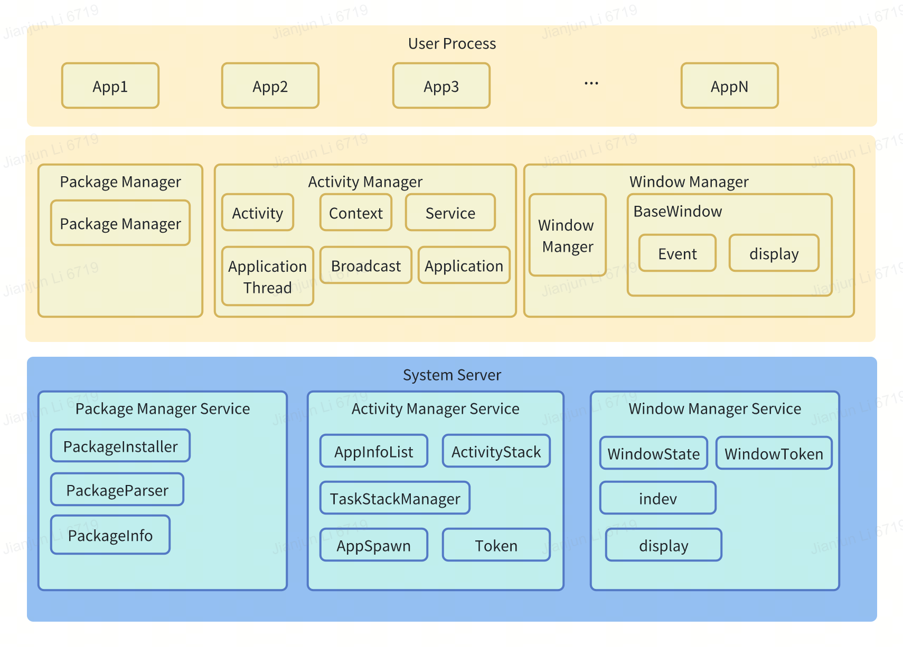

# System Server

[English | [简体中文](./README_zh-cn.md)]

## Introduction

`System Server` is one of the core components of the openvela operating system. It is responsible for starting and managing multiple system services, including:
1. Application Management Service
2. Package Management Service
3. Window Management Service
4. Brightness Management Service

**Figure 1** System Services Architecture Diagram



Introduction to each sub-service:

### 1 Application Management Service
The Application Management Service is responsible for managing the lifecycle and task stack of application programs. It includes the following functions:

- Manage the application lifecycle, such as starting, stopping, pausing and resuming application programs.
- Manage the application task stack, such as creating, destroying, updating, etc.
- Manage the memory usage of application programs, such as monitoring memory usage, low memory warnings, etc.

### 2 Package Management Service
The Package Management Service is responsible for managing the installation, uninstallation, updating and permissions of application programs. It includes the following functions:

- Install, uninstall, and update application programs.
- Manage application program permissions, including granting and revoking permissions, etc.
- Listen for application installation, uninstallation, and update events.

### 3 Window Management Service
The Window Management Service is responsible for managing the display and management of application program windows. It includes the following functions:

- Manage application program windows, including creating, displaying, hiding, closing, etc.
- Manage the display properties of windows, such as size, position, etc.
- Input event listening and processing, such as touch, key, etc.
- Manage window transition animations.

### 4 Brightness Management Service
The Brightness Management Service is responsible for managing the brightness of the screen. It includes the following functions:

- Manage the brightness of the screen.
- Listen for screen brightness change events.

## Directory

```
├── services
│   ├── am
│   ├── brightness
│   ├── CMakeLists.txt
│   ├── event_server
│   ├── include
│   ├── Kconfig
│   ├── Make.defs
│   ├── Makefile
│   ├── pm
│   ├── system_server
│   ├── wm
│   └── xmsdemo
```

## Constraints

- The `./Kconfig` file lists the configuration switches for the System Services' configurable sub-services. The corresponding configuration switches for each sub-service need to be enabled in the System Services' compilation options.
- Compilation options for each sub-service are configured in the `./Make.defs` file.

## Instructions

### Compilation and Execution

The System Services use the Vela source code to build the system for compilation and execution. Before compiling the Vela source code, the corresponding compilation tools and dependency libraries need to be installed. When compiling the Vela source code, the System Server compilation option needs to be selected, and the compilation options for each service also need to be turned on accordingly, and then compiled.

The configuration options are as follows:
- `SYSTEM_SERVER`: This option needs to be turned on for compiling the System Services.
- `SYSTEM_ACTIVITY_SERVICE`: This option needs to be turned on for compiling the Application Management Service.
- `SYSTEM_PACKAGE_SERVICE`: This option needs to be turned on for compiling the Package Management Service.
- `SYSTEM_WINDOW_SERVICE`: This option needs to be turned on for compiling the Window Management Service.
- `SYSTEM_BRIGHTNESS_SERVICE`: This option needs to be turned on for compiling the Brightness Management Service.

Running `System Server` on the device requires root privileges. `SystemServer` can be started to run in the background via the adb command, as shown below:

```
adb shell systemd &
```