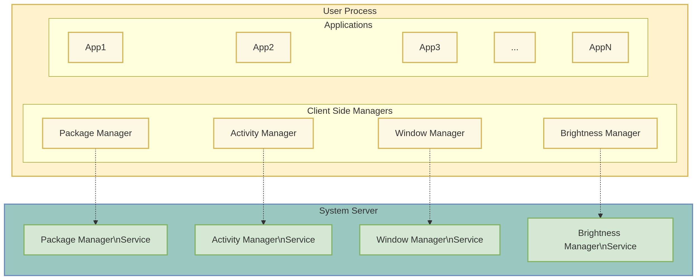

# System Server

[ English | [简体中文](./README_zh-cn.md) ]

## Introduction

**System Server** is a core component of the openvela operating system, responsible for starting, managing, and coordinating key system services. It acts as the "brain" of the system, maintaining its normal operational state.

The current version includes the following core sub-services:

1. Activity Manager Service (Activity Manager)
2. Package Manager Service (Package Manager)
3. Window Manager Service (Window Manager)
4. Brightness Manager Service (Brightness Manager)

**Figure 1** System Server Architecture Diagram



## Sub-service Details

### 1. Activity Manager Service

The Activity Manager Service is responsible for managing the application lifecycle and task stack. It includes the following functions:

- Manage application lifecycle, such as starting, stopping, pausing, and resuming applications.
- Manage application task stacks, such as the creation, destruction, and updating of task stacks.
- Manage application memory usage, such as monitoring memory usage, low memory warnings, etc.

### 2. Package Manager Service

The Package Manager Service is responsible for managing application installation, uninstallation, updates, and permissions. It includes the following functions:

- Install, uninstall, and update applications.
- Manage application permissions, including granting and revoking permissions.
- Listen for application installation, uninstallation, and update events.

### 3. Window Manager Service

The Window Manager Service is responsible for the display and management of application windows. It includes the following functions:

- Manage application windows, including creation, display, hiding, closing, etc.
- Manage window display properties, such as size, position, etc.
- Handle input event listening, such as touch, key presses, etc.
- Manage window transition animations.

### 4. Brightness Manager Service

The Brightness Manager Service is responsible for managing screen brightness. It includes the following functions:

- Manage screen brightness.
- Listen for screen brightness change events.

## Directory Structure

```bash
├── Kconfig              # Build configuration definition file, containing build switches for sub-services
└── SystemServer.cpp     # System Server main program entry and startup logic
```

## Compilation and Configuration

System Server is compiled based on the **build system**. Before compiling, please ensure that the `Kconfig` options are correctly configured to include the required sub-services.

### Configuration Options (Kconfig)

Please enable the following options in the compilation configuration menu:

| Definition Name             | Description        | Remarks                                  |
| :-------------------------- | :----------------- | :--------------------------------------- |
| `SYSTEM_SERVER`             | **Main Switch**    | Must be enabled to compile System Server |
| `SYSTEM_ACTIVITY_SERVICE`   | Activity Manager   | Optional component                       |
| `SYSTEM_PACKAGE_SERVICE`    | Package Manager    | Optional component                       |
| `SYSTEM_WINDOW_SERVICE`     | Window Manager     | Optional component                       |
| `SYSTEM_BRIGHTNESS_SERVICE` | Brightness Manager | Optional component                       |

## Run Guide

Running `SystemServer` on the target device requires **Root permissions**.

You can manually start the service in the background via ADB:

```bash
# Note: The generated binary filename is assumed to be systemd; please adjust according to the actual build output
adb shell systemd &
```
